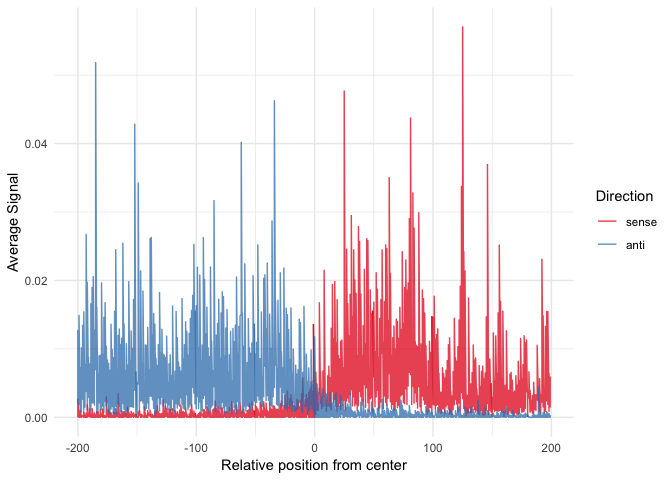

<!-- README.md is generated from README.Rmd. Please edit that file -->
TeMPO
=====

TeMPO is an R/Bioconductor package for producicing *meta profiles* (also known as *meta genes*, *average profiles* or *average footprints*) over one or more sets of genomic locations and signals. It takes as input various standard Bioconductor S4-classes and outputs simple data.frames for plotting with `ggplot2` or manipulation using the tidyverse.

Installation
------------

### From Github

First install the dependencies from Bioconductor:

``` r
BiocManager::install(
    c("S4Vectors",
    "GenomicRanges",
    "rtracklayer"
    "BiocGenerics",
    "IRanges",
    "GenomeInfoDb",
    "BiocParallel",
    "BiocStyle",
    "AnnotationHub")
)
```

Then install TeMPO using `devtools`:

``` r
devtools::install_github("MalteThodberg/TeMPO")
```

### From Bioconductor

Coming soon...!

Usage
-----

``` r
library(TeMPO)
library(magrittr)
library(tidyr)
library(ggplot2)

data("CAGE_clusters")
data("CAGE_plus")
data("CAGE_minus")

# Stranded Meta-profile across enhancers:
P <- tidyMetaProfile(sites = subset(CAGE_clusters, 
                                    clusterType=="enhancer"),
                     forward = CAGE_plus,
                     reverse = CAGE_minus,
                     upstream=200,
                     downstream=200)

# Plot the resulting tibble with ggplot2:
P %>%
    gather(key="direction", value="score", sense, anti, factor_key=TRUE) %>%
    ggplot(aes(x=pos0, y=score, color=direction)) +
    geom_line(alpha=0.75) +
    scale_color_brewer("Direction", palette="Set1") +
    labs(x="Relative position from center", 
         y="Average Signal") +
    theme_minimal()
```



See the TeMPO vignette for full documentation!
